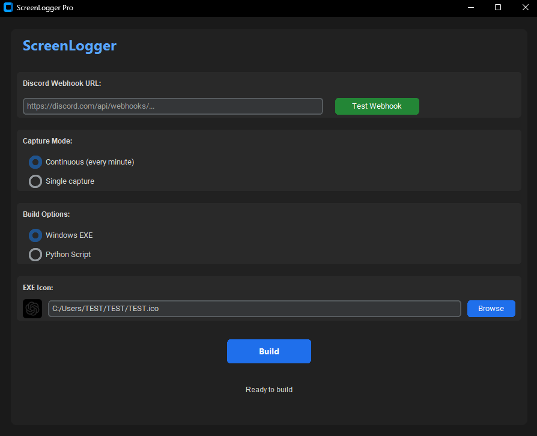
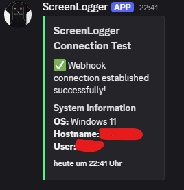
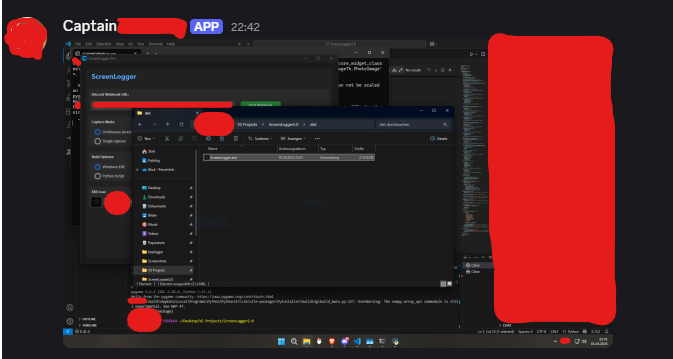

# 🚀 ScreenLogger Ultimate - Educational Tool [](LICENSE)

<div align="center">

  
*The beautiful dark-mode UI*

<div align="center">
  
    
</div>
*Professional Discord webhook logs showing system info and screenshots*

</div>

## 📌 Disclaimer
**This software is for educational purposes only**  
⚠️ Use only on systems you own or have permission to monitor  
⚠️ Not responsible for misuse of this tool  
⚠️ Created to demonstrate Python automation capabilities

## 🔥 Features
- ✨ GitHub-inspired dark theme
- 📸 Automatic screenshots (single or continuous)
- 🤖 Discord webhook integration
- 🏗️ Easy EXE conversion
- 🔒 Configurable capture settings
- 📈 System monitoring capabilities

## 🛠️ Setup
1. Run the automated setup:
```bash
setup.bat
```

2. Configure your Discord webhook in `config.py`

3. Build the EXE:
```bash
python main.py
```

## 🖼️ Assets Info
Place your screenshots in:
```
assets/images/
```
- `ui-preview.png` - Application UI preview  
- `discord-logs.png` - Example Discord messages

## 📜 Crystal License
This software is released under the [Crystal License](LICENSE):
- Free for educational use
- Allows modification and redistribution
- No warranty provided
- Not liable for misuse
- Must include original license

## ⚠️ Legal Notice
By using this software, you agree:
- You will use it only for legitimate educational purposes
- You have permission to monitor any target systems
- The developer is not liable for any misuse

```diff
+ Ethical hacking reminder: Always get proper authorization!
